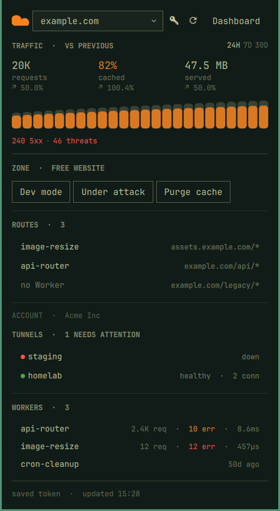
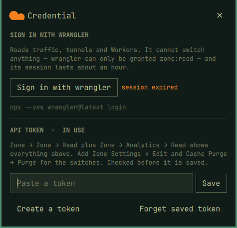
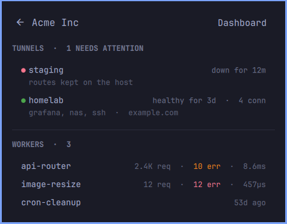
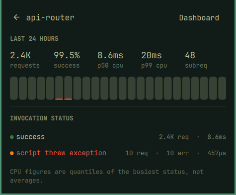

# Cloudflarechy

One Cloudflare zone in the Omarchy bar: what traffic did over the last day,
week or month, what the cache did with it, whether your tunnels are up — and
whether Development Mode or Under Attack Mode is still on from the last time
you needed it.



That last part is why the bar icon changes colour. Both of those switches are
meant to be temporary, neither is visible from the desktop, and both get left on
for days — so the whole mark turns your theme's urgent colour and grows a dot,
rather than whispering it in five pixels. The same happens when a Cloudflare
Tunnel is `down` or `degraded`, or when the zone starts answering 5xx at a rate
worth looking at. Hovering the icon says which.

Everything shown comes from the Cloudflare API. Nothing is computed locally
except the cache ratio, which is cached ÷ total over the same window, and
the period-over-period deltas, which are derived from the same one request.

## Install

```bash
omarchy plugin add https://github.com/yamz8/cloudflarechy --enable
```

That clones it, validates the manifest, and offers to place it on the bar. It
lands in `~/.config/omarchy/plugins/cloudflarechy/` — the directory is named
from the manifest id, not the repository. Later, `omarchy plugin update
cloudflarechy` pulls new versions.

Already on disk, and you only want it on the bar:

```bash
omarchy plugin enable cloudflarechy --section right
omarchy bar move cloudflarechy --after omarchy.tray   # somewhere else in the row
```

Nothing needs to be prepared first. Open the panel and it shows a **Connect**
screen with two routes:

- **Sign in with wrangler** — one click, launches `wrangler login` in a
  terminal, and gives you the full read-only dashboard.
- **Paste an API token** — adds the switches and a bar dot you can trust
  overnight.



Either can be changed later: the key icon in the panel header (or `c`) reopens
that screen, so a wrangler session can be upgraded to a token whenever you like,
and a saved token can be forgotten to fall back to wrangler.

Plugins are unsandboxed code in your long-lived shell process, so read
`bin/cloudflarechy` and the QML before you install this — it is about 500 lines
of bash and some QML, and all the network calls are in the one script.

## The API token

The simplest route is the panel itself: press `c`, paste into the field, press
Enter. The token is checked against Cloudflare *before* it is written — a
token that does not work is worse than none, because it outranks and therefore
hides the wrangler fallback that was working a moment ago. It goes to the
helper over stdin rather than in a command line, where it would be readable
from the process list, and lands in `~/.config/cloudflarechy/token` as `600`
inside a `700` directory.

To do it by hand instead:

```bash
mkdir -p ~/.config/cloudflarechy && chmod 700 ~/.config/cloudflarechy
printf '%s\n' 'YOUR_TOKEN' > ~/.config/cloudflarechy/token
chmod 600 ~/.config/cloudflarechy/token
```

It is read from the first of these that has one, so an exported variable or a
keyring entry works just as well:

1. `$CLOUDFLARE_API_TOKEN`
2. `$CF_API_TOKEN`
3. `~/.config/cloudflarechy/token` (or `$CLOUDFLARECHY_TOKEN_FILE`)
4. `secret-tool lookup service cloudflarechy`
5. wrangler's own credential — see below

An API token, not the legacy global key — this needs a handful of scopes and a
token can be minted with exactly those:

| Scope | What it buys | Without it |
|---|---|---|
| Zone → Zone → Read | the zone list, plan, status | nothing works |
| Zone → Analytics → Read | the traffic numbers and the graph | traffic section says so |
| Zone → Workers Routes → Read | which Workers run on this domain | Routes section says so |
| Zone → Zone Settings → Read | Development Mode, security level | the two switches grey out |
| Zone → Zone Settings → Edit | flipping those two switches | they stay read-only |
| Zone → Cache Purge → Purge | Purge cache | the button errors |
| Account → Cloudflare Tunnel → Read | the tunnels list | section hidden, reason shown |
| Account → Workers Scripts → Read | the Workers list | section hidden |
| Account → Account Analytics → Read | Workers traffic and CPU | deploy dates instead, and says so |

Read-only is a perfectly good way to run this: grant the Read scopes and the
panel becomes a dashboard whose buttons simply say why they cannot act.

### Or skip the token: `wrangler login`

If you have ever run `wrangler login`, the panel already works. With no API
token configured it falls back to wrangler's OAuth credential, which covers
everything this plugin *reads* — zones, traffic at all three windows, the
Workers answering for a zone, and the account's Workers and tunnels.

That analytics line is worth spelling out, because the scope name does not
suggest it: `zone:read` is enough for the GraphQL Analytics API, so the graph,
the totals and the deltas all work on a credential that was never granted an
analytics scope. There isn't one to grant — wrangler's catalogue has no
analytics scope at all.

It cannot cover anything this plugin *writes*, and that is a hard ceiling
rather than a precaution. The entire scope catalogue wrangler is able to
request (`wrangler login --scopes-list`) contains exactly one zone scope:

```
zone:read    Grants read level access to account zone.
```

There is no zone-settings-write and no cache-purge scope to ask for, so no
re-login can unlock the three switches. The panel marks the zone `READ-ONLY`,
disables them, and says why on hover.

The other catch is the clock. Wrangler's token lasts about an hour and only
wrangler can renew one — this plugin deliberately will not rotate the tokens in
wrangler's config, because it does not own that file and a botched rotation
would cost you your `wrangler` login. When it lapses the panel says
`wrangler session expired` and asks you to run any wrangler command. The footer
always shows which credential answered and when it runs out:

```
Acme Inc  ·  token: wrangler until 01:47  ·  updated 00:59
```

So: wrangler is the zero-setup way to look. An API token is the way to *act*,
and the only way the bar dot stays honest while you are not looking.

## What it shows

Each list shows three rows and then says how many it is standing in for —
`2 more · Zero Trust` — and the tail opens the dashboard page where all of
them live. What gets cut matters more than how much, so the rows are ranked
first: a tunnel that is down outranks one that is healthy, a Worker that is
throwing outranks one that is quiet. The count in each heading is always the
true total. Four items show all four, because `+1 more` costs the same line
the row itself would have.

### The account is a different scope, so it is a different screen

Tunnels and Workers belong to the account, not to the zone in the picker —
switching zones changes none of those rows. Sitting under the picker they read
as though they did, so they have their own screen: press `a`, or click the
account line at the foot of the zone panel.

That line is not only a way in. A tunnel going down is one of the four things
that turns the bar icon its alert colour, so the panel you open to ask *why*
has to answer without a second keystroke:

```
Acme Inc                        1 tunnel down  ·  3 Workers
```



The account screen lists every tunnel and every Worker rather than the top
three and a "N more" tail — it has the room, and the cap on the zone panel was
only ever there because these sections were on it.

A Worker's figures go amber the moment it throws anything and red once more
than 5% of its invocations fail — the same line the bar icon draws for a zone's
5xx rate. Only the error count is coloured: ten failures in two and a half
thousand is worth seeing and is not the same news as twelve out of twelve.

**Workers on this zone** — the scripts answering for the domain in the picker,
each with how it is doing and the pattern it serves. This is the one Workers
question that is genuinely zone-scoped: it changes when you change zones,
unlike the account's full list, which is every script you have and lives on the
account screen. The same Worker appears in both for different reasons.

Click one to open its detail. A route with no Worker behind it says so and
stays inert. Without the scope the section names the refusal instead of
vanishing — a zone with no routes and a token that may not look are opposite
problems and should not read alike.

The switches above it carry no heading unless the zone has something to say.
`ZONE` over three buttons was a scope word labelling content that is not a
zone, and once the plan stopped showing on free zones it was a bare word
carrying nothing. It comes back as `ZONE · PAUSED`, `ZONE · READ-ONLY` or the
plan when the zone is not on the free one.

**Traffic** — requests, share served from cache, bytes served, each with how it
compares to the window before it; then one bar per bucket. Each bar is that
bucket's requests, and the filled part at its foot is the share that came from
cache. Under the graph, **5xx** and threats blocked.

`24H` / `7D` / `30D` in the section heading changes the window, and `t` cycles
it. Each range is fetched at twice its width and split on the midpoint, so the
comparison costs no extra request, and the baseline rebases with the range —
the 7-day view compares against the 7 days before it, not against yesterday.
Hours come from `httpRequests1hGroups` and days from `httpRequests1dGroups`.

The range resets to 24 hours when the panel closes. The bar dot takes its error
rate from whichever window is loaded, and the background poll keeps loading
whatever was left selected — so a panel left on 30 days would quietly redefine
what lights the icon, averaging a bad afternoon into a month until it stopped
looking like anything. Deltas are relative — a cache ratio moving
from 1% to 2% reads as `↗ 100.0%`, not as a point difference — which is the
convention Cloudflare's own cards use. They are deliberately uncoloured:
more requests can be growth or an attack, and the panel does not claim to
know which. A zone younger than 48 hours has no baseline, and no baseline
shows nothing rather than `0%`, because "unchanged" and "nothing to compare"
are different answers.

`5xx` is there because a zone serving nothing but errors reports exactly the
same request count as a healthy one — without it, a failing zone renders as a
quiet one. 4xx is counted separately and not shown: a 403 or a 404 is often the
zone doing precisely what it was told, while a 503 never is.

Point at a bar and the line under the graph names that bucket — its hour or
day, its requests, its cache share. It replaces the 5xx/threats line rather
than appearing beside it, so nothing moves. On a Worker's graph the same hover
reports requests and errors, and there it is inserted under the bars, which
cannot move them out from under the pointer. The bar being read is lit while
you are on it.

An hour with no traffic is drawn as an empty slot rather than closed up.
Cloudflare returns no row at all for a bucket in which nothing happened, so the
window is rebuilt from the clock before anything is drawn; a graph that trusted
the rows would show a quiet night as fewer, wider bars and read as steady
traffic through hours that had none.

Bar heights are square-rooted, scaled against the busiest hour in the window.
Two real shapes settled that. A zone idling at 16 requests an hour took a
3,016-request crawl, and on a linear scale every other hour — one of them 18x
the baseline — collapsed into a flat line under the spike. A logarithm fixes
that day and ruins every ordinary one, drawing a normal 3x variation as a wall
of identical bars. Square root survives both. The graph is there to show shape;
the exact figures sit above it and are not derived from it.

Where a plan does not expose a field, the panel shows `—` rather than `0` —
those are different facts. The analytics query gives up `uniques` and then
status codes one at a time rather than failing whole.

**Zone** — Development Mode (with the countdown Cloudflare is running; it
expires by itself after three hours), Under Attack Mode, and Purge cache, which
asks first because every subsequent miss goes to your origin.

Turning Under Attack *off* restores the security level that was in force before
it was turned on — that level is recorded in `~/.local/state/cloudflarechy/` at
the moment it is raised. If the plugin has no record, it falls back to `medium`.

**Tunnels** — every `cfd_tunnel` on the account, its status and its connection
count, which is what separates "healthy" from "healthy, on one leg".

**Workers** — every script on the account, with 24h invocations, errors and
p50 CPU time:

```
pokachy              4.2K req · 8.6ms
api-cors-preflight   3.6K req · 458µs
cron-cleanup                    18d ago
```

Requests are summed across invocation statuses. CPU is not — a quantile is not
an average, and averaging two p50s describes nothing — so the figure shown is
the p50 of the busiest status for that script. A Worker with no invocations in
the window has no analytics row at all, which is different from one that ran
zero times, so it falls back to saying when it was last deployed.

**Click a Worker** and the panel gives that script the whole screen:



Requests, success rate and p50 CPU across the top, with p99 and subrequests on
the line under them, its own 24h graph with errors filled in, and the
invocation-status breakdown — which is where a
failure actually gets explained, since `scriptThrewException` and
`clientDisconnected` mean very different things and the dashboard buries both.
Each status keeps its own quantiles rather than inheriting the headline pair.
The success rate never rounds up to 100%: a Worker at 99.6% is not a Worker
with no failures. `Esc` or the arrow goes back; **Dashboard** opens that
Worker's metrics tab.

This view is always the last 24 hours, whatever window the zone is showing.
Invocation analytics are not retained far enough back to offer the week and the
month the traffic graph does, so rather than a selector with two options that
would usually be empty, the window is fixed — and the heading says so when you
arrived from a wider one.

Deliberately absent: DNS records, firewall rules, R2, Pages. Those are editing
surfaces, and editing them from a popup you opened by accident is a bad idea.
The Dashboard button is one click from all of them.

## Keys and clicks

| | |
|---|---|
| click the icon | open/close the panel |
| right-click the icon | refresh now |
| `r` | refresh now |
| `t` | next traffic range — 24h, 7d, 30d |
| `a` | the account — tunnels and Workers |
| `c` | credential screen — sign in, paste a token, or forget one |
| `Esc` | leave the account screen, a Worker's detail, or the credential screen |
| `d` | toggle Development Mode |
| `u` | toggle Under Attack Mode |
| `p` | purge cache (asks first) |
| `←` / `→` | previous/next zone |
| `Enter` | open this zone in the dashboard |
| `Esc` | close, or cancel the purge prompt |
| `Tab` | next bar panel |

## Settings

In `~/.config/omarchy/shell.json`, on the widget's entry — or through the bar's
own settings UI:

| Key | Default | Meaning |
|---|---|---|
| `zone` | `""` | Domain to show, e.g. `example.com`. Empty uses the first zone the token can read. |
| `refreshSeconds` | `300` | Background poll interval. The bar dot is only as fresh as this. |
| `showTunnels` | `true` | Show the tunnels section. |
| `showWorkers` | `true` | Show the Workers section. |
| `attentionDot` | `true` | Colour the bar icon, and add a dot, when something needs attention. Off keeps the bar quiet. |
| `errorPercent` | `5` | Share of requests answering 5xx before the icon lights. Needs 20+ of them as well, so a quiet hour cannot trip it. `0` turns this trigger off and leaves the switch and tunnel ones. |

## From the command line

`bin/cloudflarechy` is the whole data layer and is useful on its own — every
subcommand prints one JSON object, errors included:

```bash
./bin/cloudflarechy status
./bin/cloudflarechy setup                      # what credentials this machine could use
printf '%s\n' TOKEN | ./bin/cloudflarechy save-token   # checked, then saved 600
./bin/cloudflarechy forget-token
./bin/cloudflarechy zones
./bin/cloudflarechy overview <zone-id>
./bin/cloudflarechy tunnels <account-id>
./bin/cloudflarechy workers <account-id>
./bin/cloudflarechy worker  <account-id> <script>
./bin/cloudflarechy devmode <zone-id> on|off
./bin/cloudflarechy attack  <zone-id> on|off
./bin/cloudflarechy purge   <zone-id>
```

Reads are cached briefly under `~/.cache/cloudflarechy` (zones and Workers 5
minutes, overview and tunnels 1 minute) so a background poll and an open panel
do not each cost an API call. A leading `--fresh` skips the cache; writes drop
the entry for the zone they touched.

The running widget answers over IPC too:

```bash
omarchy-shell cloudflarechy status     # one line: zone, dev mode, attack, tunnels
omarchy-shell cloudflarechy refresh
omarchy-shell cloudflarechy worker <script>    # open that Worker's detail view
omarchy-shell cloudflarechy toggle
```

## Tests

```bash
./tests/run.sh
```

140 contract tests over `bin/cloudflarechy`, run against `tests/mock-api.py` —
a stand-in shaped like the real API. They pin the things that are easy to break
without noticing: the write guard, the security-level save *and* its fallback,
the analytics query giving up one optional field at a time, 4xx never being
counted as 5xx, Workers CPU coming from the busiest status rather than an
average of quantiles, a Worker's totals counting every status and not just the
successful ones, the read cache and its `--fresh` bypass, and that a
rejected token is never written to disk.

Everything runs under a temporary `HOME`, so the suite cannot touch your real
config, cache, or wrangler login.

Two honest limits. A fixture cannot tell you Cloudflare still answers this way
— only that the plugin still does; every field in the mock was checked against
a live account once, and that is the whole of its authority. And the suite
covers the script, not the QML: the panel is still verified by looking at it.

## Screenshots and the demo

```bash
./tests/capture.sh     # the four images above
./tests/demo.sh            # a ~20s recording, demo.mp4
./tests/demo.sh --social   # a ~19s cut for a feed, demo-social.mp4
```

Regenerates the three images above against the mock, so the README shows the
panel as it is rather than as it was several releases ago. It stands up
`tests/mock-api.py`, points the plugin at it, takes the pictures on an empty
workspace, and puts everything back — your token is moved aside and returned,
and the request path goes back to Cloudflare whether or not the run succeeds.

The panel in these images is always `example.com` and Acme Inc. No screenshot
in this repo should ever contain a real account.

`demo.sh` records the same way and for the same reason: against the mock, so
the write beats — Development Mode, the purge prompt — can be shown without
touching a live site, and so nothing anyone's Cloudflare holds ends up in a
video on the internet. It asks the mock for a calm account first
(`CLOUDFLARECHY_MOCK_CALM`), because the fixture normally keeps a tunnel down
and the bar icon would then be alerting before the recording starts — which
is no use when the point is watching it light up.

Every beat is a keystroke, so nothing depends on where the mouse is. The
recording is gitignored: it is a megabyte that changes wholesale on each take,
and the script that makes it is the part worth keeping.

`--social` makes a different cut, for a feed that autoplays it on a phone:
1080x1350 at 60fps, about two seconds on each view — the zone at a day and
a week, a Worker, the zone at a month, the account — and then the panel going through three
Omarchy themes and back. The shell is drawn at a
larger type size while it records so the panel fills the frame with real
pixels. The shell's wallpaper wipe drops to black for a few frames as it
finishes; those frames are cut and the one before held. The themes and the type size live only in the running shell's memory —
nothing is written — and the restart at the end puts your own back. The mock
serves traffic with a day in it for this cut (`CLOUDFLARECHY_MOCK_SHOWCASE`);
the tests never ask for it. `CLOUDFLARECHY_DEMO_KEEP=<dir>` keeps the raw
recording and its timings.

The assertions were checked by breaking the code on purpose and confirming they
went red. That found a real gap the first time — the security-level fallback
was untested, and a sabotaged one passed 52 of 52 — and the suite has since
caught a refactor that silently deleted three functions.

## Notes

- Traffic comes from the GraphQL Analytics API (`httpRequests1hGroups`), which
  every plan can read. The REST dashboard endpoint it replaced is gone for new
  zones. If the plan rejects the `uniques` field, the query is retried without
  it rather than failing the whole graph.
- Editing this plugin's QML hot-reloads for most changes, but a bar widget that
  is already mounted can keep the old component; `omarchy restart shell` is the
  reliable way to see an edit.
- The wrangler fallback only ever issues reads. Writes stop inside
  `bin/cloudflarechy` rather than at Cloudflare, so you get a sentence about
  which credential you are holding instead of a passed-through `9109`.
- The cloud mark is drawn in QML, not Cloudflare's logo file. It follows your
  theme on the bar and goes orange in the panel header.
- The screenshot above was taken against a local stand-in API, so the zone,
  tunnels and Workers in it are invented.

## Uninstall

```bash
omarchy plugin disable cloudflarechy
rm -rf ~/.config/omarchy/plugins/cloudflarechy ~/.cache/cloudflarechy ~/.local/state/cloudflarechy
```

MIT licensed. Not affiliated with Cloudflare.
